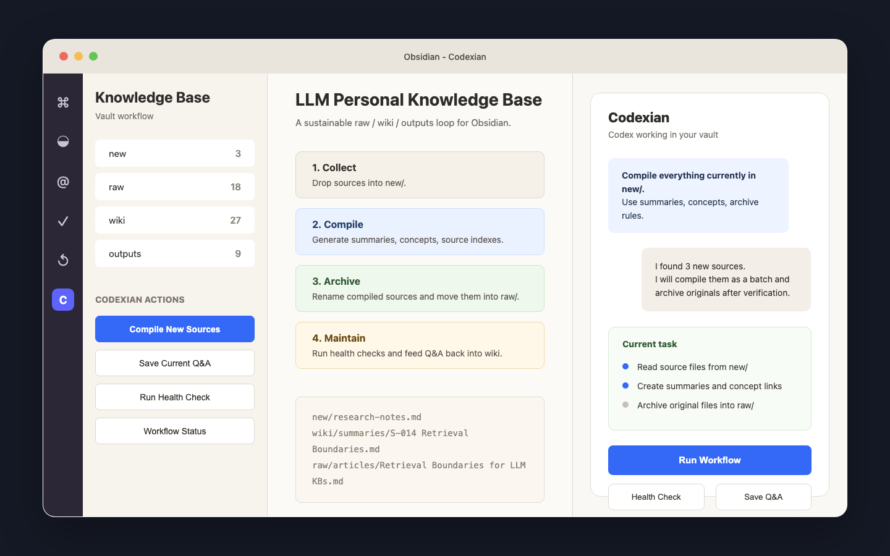

# Codexian

[English](README.md) | 简体中文

Codexian 是一个 Obsidian 桌面端插件，把 Codex 带进你的 vault，让 Codex 以当前 vault 为工作目录进行对话、编辑、搜索、运行工作流。它提供侧边栏聊天、行内编辑、文件引用、Codex Skills、子代理、MCP 支持，并内置一套面向个人知识库的结构化工作流。



## Codexian 解决什么问题

Obsidian 很适合长期保存知识，但要让知识库持续可用，仍然需要大量重复工作：收集资料、摘要、抽取概念、维护索引、保存高价值问答、定期检查结构是否失控。

Codexian 把这些工作放回 Obsidian 内完成。插件让 Codex 直接理解并操作你的 vault，同时提供一套围绕 `new/`、`raw/`、`wiki/`、`outputs/` 的知识库工作流，让资料从输入到复用形成闭环。

## 功能

- Obsidian 内置 Codex 聊天侧边栏。
- 对选中文本或光标位置进行行内编辑，并提供 diff 预览。
- 支持通过 `@mention` 引用 vault 文件、Codex 子代理和部分外部上下文。
- 从 `.codex/skills/` 和 `.agents/skills/` 加载 Codex Skills。
- 多标签会话、历史记录、fork、resume、compact。
- 通过工具栏控制 Plan mode 和权限模式。
- 支持 `#` 指令模式。
- 支持英文和简体中文界面。默认跟随 Obsidian 的语言设置，也可以在 Codexian 设置页手动切换。
- 支持由 Codex CLI 管理的 MCP，服务器可通过 `codex mcp` 配置。
- 左侧按钮和命令面板提供知识库工作流：
  - 编译 `new/` 中的新来源。
  - 保存当前问答。
  - 运行知识库健康检查。
  - 应用低风险健康修复。
  - 撤销最近一次来源归档。
  - 运行端到端工作流验收检查。
  - 打开工作流状态和工作流入口。
- 设置页提供首次初始化入口，用于创建知识库脚手架。

## 知识库工作流

Codexian 默认围绕三层知识库结构运行：

```text
new/                  等待编译的新来源
raw/                  已归档的原始来源
wiki/                 可复用知识：摘要、概念、索引、地图
outputs/              问答、健康检查、报告和其他工作流产物
```

初始化器会创建以下结构，并且不会覆盖已有笔记：

```text
new/
raw/
  inbox/
  articles/
  posts/
  papers/
  transcripts/
wiki/
  indexes/
  summaries/
  concepts/
  maps/
outputs/
  qa/
  health/
  reports/
AGENTS.md
wiki/indexes/All-Sources.md
wiki/indexes/All-Concepts.md
wiki/maps/LLM Personal Knowledge Base Workflow.md
.codex/skills/
```

把待处理资料放进 vault 根目录的 `new/`，然后点击左侧按钮或在命令面板运行 `Codexian: 编译新来源`。Codexian 会向 Codex 发送固定工作流提示词，读取新文件，生成摘要，更新索引和概念，并把已编译的原文件归档到 `raw/articles/`、`raw/posts/`、`raw/papers/`、`raw/transcripts/` 或 `raw/inbox/`。

归档时，插件会要求 Codex 根据文章内容为原文件制定更清晰、更贴切主题的新标题。遇到重名文件时不会覆盖已有文件，移动记录会写入 `outputs/reports/YYYY-MM-DD-archive-log.md`。

## 依赖要求

- Obsidian 桌面版 1.4.5 或更新版本。
- 开发构建需要 Node.js 22 或更新版本。
- 本机需要可用的 Codex CLI。
- macOS、Windows 或 Linux 桌面环境，前提是 Obsidian 与 Codex CLI 可正常运行。

如果你在 macOS 上使用 Codex.app，Codex CLI 路径通常是：

```text
/Applications/Codex.app/Contents/Resources/codex
```

## 在 Obsidian 中安装

### 从 GitHub Release 安装

1. 从 GitHub Releases 页面下载 `codexian-1.0.0.zip`。
2. 如果 vault 中还没有这个目录，先创建：

```text
<你的 vault>/.obsidian/plugins/codexian/
```

3. 将压缩包里的三个文件解压到该目录：

```text
main.js
manifest.json
styles.css
```

4. 重启应用，或在命令面板运行 `Reload app without saving`。
5. 打开 `设置 -> 第三方插件`。
6. 如果需要，先启用第三方插件，然后启用 `Codexian`。
7. 打开 `设置 -> Codexian`，确认 Codex CLI 路径。

### 从源码构建

```bash
npm install
npm run build
```

构建后，项目根目录会生成 `main.js`、`manifest.json`、`styles.css`。把这三个文件复制到：

```text
<你的 vault>/.obsidian/plugins/codexian/
```

本地开发时，可以在 `.env.local` 中设置 `OBSIDIAN_VAULT`，然后运行：

```bash
npm run build
```

构建脚本会把插件产物复制到配置的 vault 插件目录。

## 设置项

Codexian 的插件设置保存在：

```text
<vault>/.codexian/codexian-settings.json
```

设置页包括：

- Codex CLI 路径。
- 语言：自动、英文、简体中文。
- Provider 与运行时选项。
- 知识库初始化入口。
- 单次编译批量大小。
- 摘要、概念、归档和报告模板。
- 将已编译来源分类到 `raw/` 的归档规则。

## 开发

```bash
npm install
npm run typecheck
npm run lint
npm run test
npm run build
```

本项目主要使用：

- TypeScript。
- Obsidian Plugin API。
- Codex CLI 会话与运行时集成。
- esbuild。
- Jest。
- ESLint 与 TypeScript 支持。
- `smol-toml` 用于解析 TOML。

## 隐私与安全

Codexian 在 Obsidian 内本地运行，并调用本机 Codex CLI。为了实现 vault-aware 工作流，插件可以读取和写入当前 vault 中的文件。根据权限模式，Codex 在获得允许后也可以运行本地命令。

请认真检查权限提示，不要把密钥放进 vault，也不要把私密凭证写入可能被模型或工具读取的笔记。

Codex 本身是否访问网络，取决于用户的 Codex CLI 配置和账号。Codexian 不额外加入遥测、广告或自更新机制。

当用户配置外部上下文目录或本地 MCP 工具时，Codex 可能会按权限模式读取 vault 外文件或调用本地工具。

## 作者

Codexian 由 HalfMelon 创建并维护，项目在 Codexian 仓库中开发。

## 致谢

Codexian 吸取了 Claudian 在 Obsidian 代理式工作流上的想法，并针对 Codex-only 场景进行了改造和优化，加入了结构化知识库、来源编译、自动归档和健康检查等能力。

感谢 Linux.Do 社区。社区的开源精神和务实讨论鼓励了本项目。

## 许可证

MIT。
